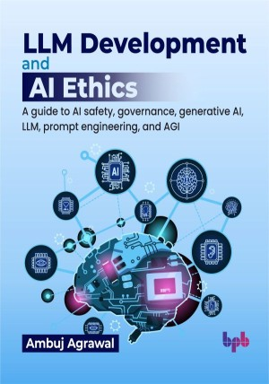

# LLM Development and AI Ethics

A guide to AI safety, governance, generative AI, LLM, prompt engineering, and AGI.

This is the repository for [LLM Development and AI Ethics
](https://bpbonline.com/products/llm-development-and-ai-ethics?_pos=1&_sid=7c8530a94&_ss=r&variant=44554609164488?variant=44554609164488),published by BPB Publications.

## About the Book
The rapid evolution of AI, especially generative AI, presents both opportunities and critical challenges. This book addresses the urgent need for responsible AI development, focusing on safety, alignment, and robust governance. We explore how to navigate the complexities of AI, ensuring its benefits are harnessed while mitigating potential risks.

This book will cover the foundational concepts of AI, from ML to the cutting-edge of large language models (LLMs) and prompt engineering. Each chapter provides key insights into AI safety initiatives, governance frameworks, and the practical development of secure AI applications. You will learn how to approach AI with an ethical mindset, understanding the importance of interpretability, risk management, and the societal implications of AI advancements, all the way to contemplating the future of artificial general intelligence (AGI).

Upon completing this book, you will possess a comprehensive understanding of AI's current state and future trajectories. You will gain the knowledge to contribute to the responsible development and deployment of AI technologies, ready to engage in the crucial conversations shaping our AI-driven world.

## What You Will Learn
• Create generative AI applications for text, music, image, and video generation.

• Develop ML models and LLMs from scratch.

• Work towards advancing the field of AI safety and alignment.

• Build AI applications with AI governance and security.

• Create AI governance frameworks for your organizations.

• Develop better prompts for generative AI models using the prompt engineering techniques mentioned in the book.

• Build AI agents for workflow automation.

• Understand the latest trend in generative AI research and the current progress towards AGI.
